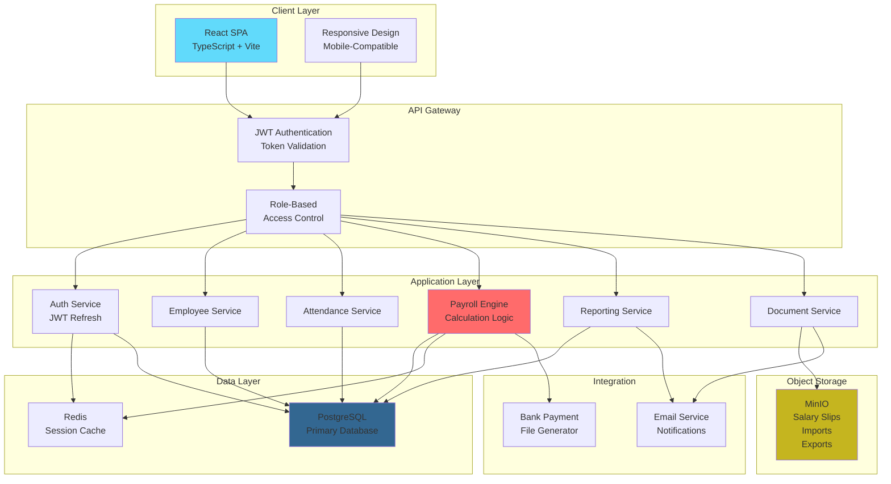
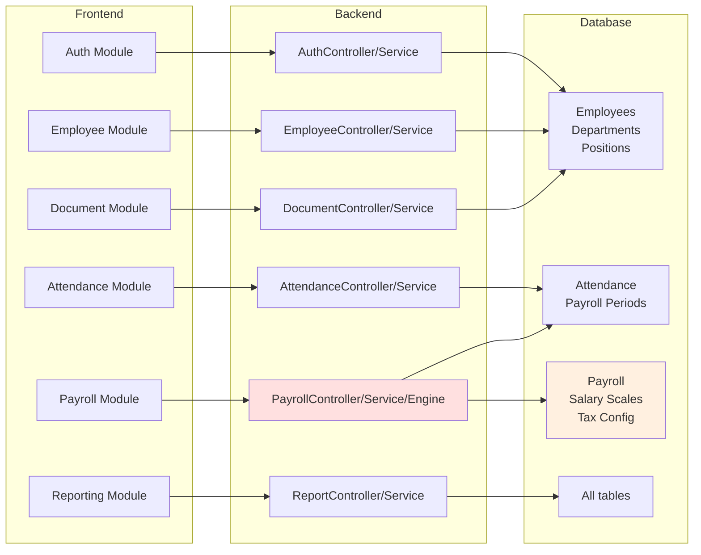
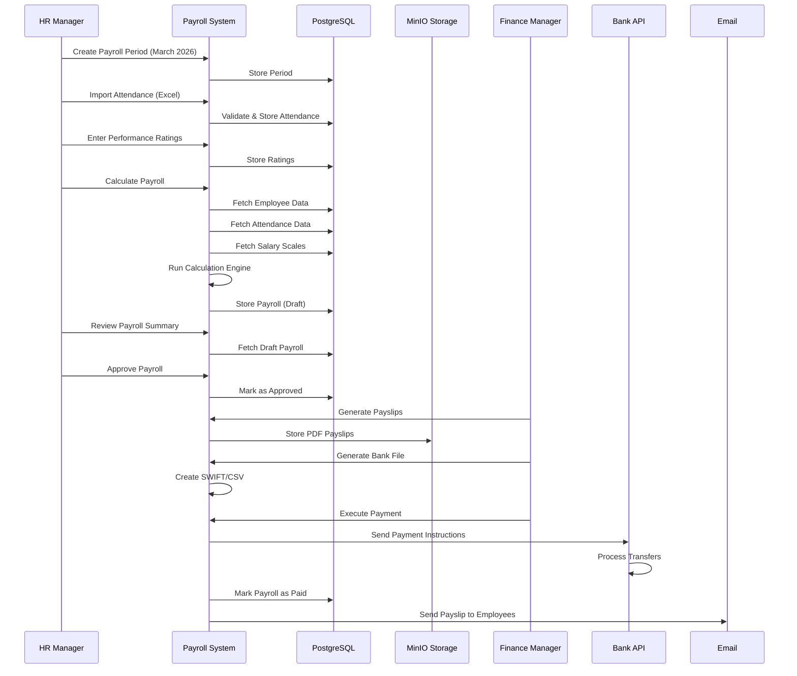
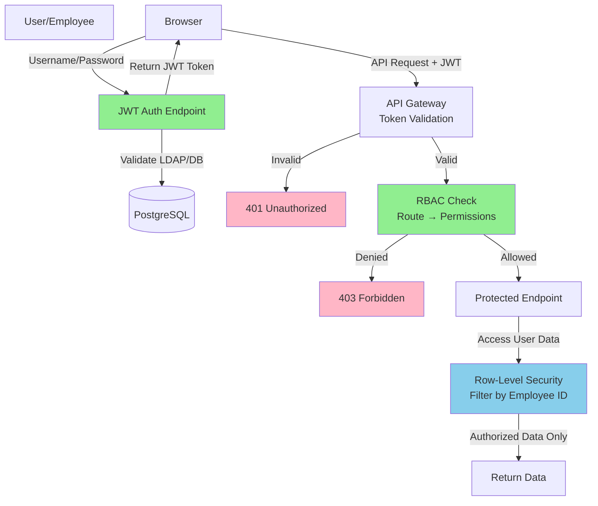
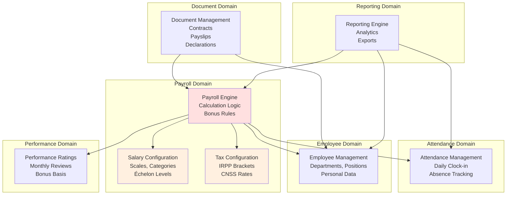
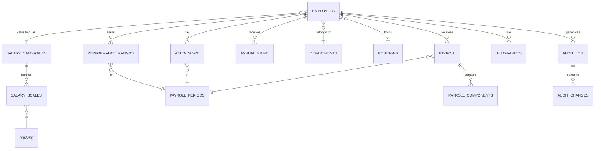

# MARAM CONFECTION Payroll Platform - Implementation Roadmap

**Document Version:** 1.0  
**Last Updated:** June 2026  
**Status:** Ready for Development  
**Audience:** Development Team, Product Owners, Project Managers

---

## Table of Contents

1. [Project Vision](#1-project-vision)
2. [High-Level Architecture](#2-high-level-architecture)
3. [Domain Driven Design](#3-domain-driven-design)
4. [Database Design](#4-database-design)
5. [MinIO Design](#5-minio-design)
6. [Backend Module Structure](#6-backend-module-structure)
7. [Frontend Structure](#7-frontend-structure)
8. [Security Design](#8-security-design)
9. [API Specification](#9-api-specification)
10. [Sprint Planning](#10-sprint-planning)
11. [Testing Strategy](#11-testing-strategy)
12. [Migration Strategy](#12-migration-strategy)
13. [Definition of Done](#13-definition-of-done)
14. [Technical Debt Prevention](#14-technical-debt-prevention)

---

## 1. Project Vision

### 1.1 Business Objectives

**Primary Goal:** Replace manual Excel-based payroll management with an automated, enterprise-grade web platform that:
- Eliminates 95% of manual payroll calculations
- Reduces payroll processing time from 5 days to 2 hours
- Achieves 100% accuracy in salary/tax calculations
- Provides real-time visibility into payroll operations
- Ensures full compliance with Tunisian labor law

**Secondary Goals:**
- Provide self-service portal for employees (view payslips, attendance)
- Enable data-driven HR analytics
- Establish audit trail for all payroll operations
- Support seamless bank payment integration
- Reduce HR administrative burden by 60%

### 1.2 Scope

**In Scope:**
✅ Employee Master Data Management  
✅ Daily Attendance Tracking  
✅ Monthly Payroll Calculation  
✅ Multi-Component Salary System (base, allowances, deductions)  
✅ Progressive Tax Calculation (IRPP)  
✅ Social Security Contribution (CNSS)  
✅ Performance-Based Bonuses  
✅ Annual Prime (End-of-Year Bonus) Calculation  
✅ Payslip Generation & Distribution (PDF)  
✅ Bank Payment File Generation  
✅ HR Analytics & Reports  
✅ Tax Declaration Generation  
✅ Approval Workflows (HR → Finance → Payment)  
✅ Document Management (Contracts, Certifications)  
✅ User Authentication & Role-Based Access Control  
✅ Audit Logging  
✅ Data Import from Excel  

**Out of Scope:**
❌ Leave/Time-Off Management (Phase 2)  
❌ Recruitment Module (Phase 2)  
❌ Training & Development Tracking (Phase 2)  
❌ Performance Appraisals (Phase 2)  
❌ Mobile Native App (Phase 2 - web responsive only)  
❌ Biometric Integration (Phase 3)  
❌ Multi-Language Support (Phase 2)  
❌ Multi-Currency Support (not needed - TND only)  
❌ HR Forecasting/Predictive Analytics (Phase 3)  
❌ Expense Management (Phase 2)  

### 1.3 Success Criteria

| Criterion | Target | Metric |
|-----------|--------|--------|
| **System Accuracy** | 100% | All calculations match Excel to 2 decimal places |
| **Payroll Processing Time** | < 2 hours | Time from period close to payment ready |
| **Data Migration Success** | 100% | All historical data imported, validated, reconciled |
| **UAT Sign-off** | 100% | Finance and HR managers approve all functionality |
| **System Uptime** | 99.9% | Availability during payroll season (Jan-Mar) |
| **User Adoption** | >90% | Active daily users (30 days post-launch) |
| **Support Response Time** | < 2 hours | Critical issues during payroll window |
| **Code Coverage** | >85% | Unit test coverage for all core logic |
| **Documentation Complete** | 100% | User guides, admin guides, API docs finalized |
| **Security Audit Pass** | 100% | Zero critical findings, <5 medium findings |

### 1.4 Budget & Timeline

| Phase | Duration | Team Size | Cost Estimate |
|-------|----------|-----------|---------------|
| Phases 1-3 (Foundation) | 8 weeks | 3 devs + 1 QA | $15,000 |
| Phases 4-6 (Core Features) | 12 weeks | 4 devs + 1 QA | $25,000 |
| Phases 7-8 (Polish) | 8 weeks | 2 devs + 1 QA | $12,000 |
| Phase 9-10 (Launch) | 4 weeks | 2 devs + 1 QA | $8,000 |
| **Total** | **32 weeks** | **3-4 FTE** | **$60,000** |

---

## 2. High-Level Architecture

### 2.1 System Architecture Diagram



### 2.2 Component Architecture



### 2.3 Data Flow - Monthly Payroll Process



### 2.4 Security Architecture



---

## 3. Domain Driven Design

### 3.1 Core Domains & Bounded Contexts



### 3.2 Domain: Employee Management

**Responsibility:** Maintain accurate employee master data, organizational structure, and salary configurations.

**Entities:**
- `Employee` - Individual employee record
- `Department` - Organizational unit
- `Position` - Job title & classification
- `SalaryCategory` - Salary band (CAT 1, 3, etc.)
- `SalaryScale` - Multiplier by échelon & year
- `Allowance` - Fixed/variable compensation components

**Key Services:**
- `EmployeeService` - CRUD operations, data validation
- `DepartmentService` - Org hierarchy management
- `SalaryConfigService` - Salary scale & allowance management
- `DocumentService` - File uploads to MinIO

**APIs:**
- `GET /api/employees` - List employees
- `POST /api/employees` - Create employee
- `PUT /api/employees/{id}` - Update employee
- `GET /api/employees/{id}/salary` - Get salary details
- `POST /api/employees/import` - Bulk import

---

### 3.3 Domain: Attendance Management

**Responsibility:** Track daily employee attendance, validate absences, and feed into payroll calculations.

**Entities:**
- `Attendance` - Daily attendance record
- `PayrollPeriod` - Month-specific payroll window
- `AttendanceCode` - Codes (8=full day, 4=half day, A=absent)

**Key Services:**
- `AttendanceService` - Record/update attendance
- `AttendanceValidationService` - Validate entries
- `AttendanceImportService` - Bulk import from Excel
- `AttendanceAnalyticsService` - Summary metrics

**APIs:**
- `POST /api/attendance` - Record daily attendance
- `GET /api/attendance/{period_id}/summary` - Attendance summary
- `POST /api/attendance/import` - Import from file

---

### 3.4 Domain: Payroll Engine (CRITICAL)

**Responsibility:** Calculate accurate monthly salaries per Tunisian labor law, including all components and deductions.

**Entities:**
- `Payroll` - Monthly payroll record (draft/approved/paid)
- `PayrollComponent` - Individual salary line items
- `TaxConfiguration` - Tax brackets & rules
- `AnnualPrime` - End-of-year bonus calculation

**Key Services:**
- `PayrollCalculationService` - MAIN calculation engine
- `SalaryCalculator` - Base salary computation
- `AllowanceCalculator` - Presence, transport, meal, child allowances
- `TaxCalculator` - IRPP progressive tax
- `CNSSCalculator` - Social security contribution
- `PayrollValidationService` - Pre-calculation checks

**Business Logic (from specification):**
```
GROSS_SALARY = Base × (Days_Worked / 26) + Allowances

ALLOWANCES:
  - Presence: Fixed × (Days_Worked / 26)
  - Transport: Fixed (always)
  - Diligence: Fixed (always)
  - Meal: Fixed × (Days_Worked / 26)
  - Child: Based on family status
  - Performance: Base × (5% if rating=8, 2.5% if rating=7, 0% if absent)

DEDUCTIONS:
  - IRPP Tax: Progressive brackets (0%, 10%, 20%, 30%)
  - CNSS: Gross × 5.95%
  - Health Insurance: Gross × (rate if enrolled)
  - Absence Penalty: (Days_Absent × Daily_Rate)

NET = GROSS + ALLOWANCES - DEDUCTIONS
```

**APIs:**
- `POST /api/payroll/calculate` - Trigger payroll calculation
- `GET /api/payroll/{id}` - Get payroll record
- `PUT /api/payroll/{id}` - Edit (draft only)
- `POST /api/payroll/{id}/approve` - Approve payroll

---

### 3.5 Domain: Reporting

**Responsibility:** Generate reports, analytics, and export data for analysis & compliance.

**Key Reports:**
1. Monthly Payroll Summary
2. Employee Demographics
3. Attendance Analysis
4. Tax Declarations (IRPP, CNSS)
5. Salary Statistics
6. Department Analytics

**Key Services:**
- `PayrollReportService` - Payroll reports
- `AttendanceReportService` - Attendance analysis
- `TaxDeclarationService` - Tax compliance reports
- `ExportService` - CSV, Excel, PDF generation

**APIs:**
- `GET /api/reports/payroll-summary` - Payroll report
- `GET /api/reports/attendance` - Attendance report
- `GET /api/reports/tax-declarations` - Tax forms

---

### 3.6 Domain: Document Management

**Responsibility:** Manage employee documents, payslips, and file storage in MinIO.

**Key Services:**
- `DocumentService` - CRUD for documents
- `PayslipGenerationService` - Generate PDF payslips
- `BankFileGenerationService` - Create payment files
- `MinIOService` - Upload/download/delete from MinIO

**Storage Buckets:**
- `employee-documents` - Contracts, certifications
- `payroll-slips` - PDF payslips
- `tax-declarations` - Government forms
- `imports` - Uploaded Excel files
- `exports` - Generated reports

---

## 4. Database Design

### 4.1 PostgreSQL Schema Overview



### 4.2 Core Tables & Flyway Migrations

#### **Migration V1__Create_Base_Schema.sql**

```sql
-- Departments Table
CREATE TABLE departments (
  id BIGSERIAL PRIMARY KEY,
  code VARCHAR(20) UNIQUE NOT NULL,
  name VARCHAR(100) NOT NULL,
  description TEXT,
  manager_id BIGINT REFERENCES departments(id),
  created_at TIMESTAMP DEFAULT CURRENT_TIMESTAMP,
  updated_at TIMESTAMP DEFAULT CURRENT_TIMESTAMP,
  created_by VARCHAR(100),
  updated_by VARCHAR(100)
);

CREATE INDEX idx_departments_code ON departments(code);
CREATE INDEX idx_departments_name ON departments(name);

-- Positions Table
CREATE TABLE positions (
  id BIGSERIAL PRIMARY KEY,
  code VARCHAR(20) UNIQUE NOT NULL,
  name VARCHAR(100) NOT NULL,
  description TEXT,
  department_id BIGINT NOT NULL REFERENCES departments(id),
  salary_grade INT CHECK (salary_grade >= 1 AND salary_grade <= 14),
  created_at TIMESTAMP DEFAULT CURRENT_TIMESTAMP,
  updated_at TIMESTAMP DEFAULT CURRENT_TIMESTAMP
);

CREATE INDEX idx_positions_code ON positions(code);
CREATE INDEX idx_positions_department ON positions(department_id);

-- Salary Categories Table
CREATE TABLE salary_categories (
  id BIGSERIAL PRIMARY KEY,
  code VARCHAR(20) UNIQUE NOT NULL,
  name VARCHAR(100),
  description TEXT,
  base_multiplier DECIMAL(5, 3) DEFAULT 1.000,
  created_at TIMESTAMP DEFAULT CURRENT_TIMESTAMP,
  updated_at TIMESTAMP DEFAULT CURRENT_TIMESTAMP
);

CREATE UNIQUE INDEX idx_salary_categories_code ON salary_categories(code);

-- Employees Table
CREATE TABLE employees (
  id BIGSERIAL PRIMARY KEY,
  employee_id VARCHAR(20) UNIQUE NOT NULL,
  first_name VARCHAR(100) NOT NULL,
  last_name VARCHAR(100) NOT NULL,
  full_name VARCHAR(200) NOT NULL,
  date_of_birth DATE,
  gender CHAR(1),  -- M or H
  hire_date DATE NOT NULL,
  department_id BIGINT NOT NULL REFERENCES departments(id),
  position_id BIGINT REFERENCES positions(id),
  category_id BIGINT NOT NULL REFERENCES salary_categories(id),
  echelon INT DEFAULT 1 CHECK (echelon >= 1 AND echelon <= 14),
  base_salary DECIMAL(10, 2),
  hourly_rate DECIMAL(8, 2),
  family_status VARCHAR(10),  -- C, M1, M2, M3
  number_of_children INT DEFAULT 0,
  national_id VARCHAR(20) UNIQUE,
  cnss_number VARCHAR(20) UNIQUE,
  phone_number VARCHAR(20),
  email VARCHAR(100),
  address VARCHAR(255),
  city VARCHAR(100),
  zip_code VARCHAR(10),
  payment_method VARCHAR(20),  -- BANK_TRANSFER or CASH
  bank_account_number VARCHAR(30),
  bank_code VARCHAR(10),
  employment_status VARCHAR(20),  -- ACTIVE, INACTIVE, LEAVE, TERMINATED
  termination_date DATE,
  termination_reason VARCHAR(255),
  created_at TIMESTAMP DEFAULT CURRENT_TIMESTAMP,
  updated_at TIMESTAMP DEFAULT CURRENT_TIMESTAMP,
  created_by VARCHAR(100),
  updated_by VARCHAR(100)
);

CREATE INDEX idx_employees_id ON employees(employee_id);
CREATE INDEX idx_employees_department ON employees(department_id);
CREATE INDEX idx_employees_status ON employees(employment_status);
CREATE INDEX idx_employees_hire_date ON employees(hire_date);
CREATE INDEX idx_employees_email ON employees(email);
CREATE FULL TEXT INDEX idx_employees_search ON employees(full_name);
```

#### **Migration V2__Create_Salary_Tables.sql**

```sql
-- Salary Scales Table
CREATE TABLE salary_scales (
  id BIGSERIAL PRIMARY KEY,
  category_id BIGINT NOT NULL REFERENCES salary_categories(id),
  echelon INT NOT NULL CHECK (echelon >= 1 AND echelon <= 14),
  year INT NOT NULL,
  salary_multiplier DECIMAL(5, 3) NOT NULL,
  annual_salary DECIMAL(10, 2),
  increase_amount DECIMAL(10, 2),
  increase_percent DECIMAL(5, 2),
  created_at TIMESTAMP DEFAULT CURRENT_TIMESTAMP,
  updated_at TIMESTAMP DEFAULT CURRENT_TIMESTAMP,
  valid_from DATE NOT NULL,
  valid_to DATE,
  UNIQUE (category_id, echelon, year)
);

CREATE INDEX idx_salary_scales_year ON salary_scales(year);
CREATE INDEX idx_salary_scales_valid_dates ON salary_scales(valid_from, valid_to);

-- Allowances Table
CREATE TABLE allowances (
  id BIGSERIAL PRIMARY KEY,
  employee_id BIGINT NOT NULL REFERENCES employees(id),
  allowance_type VARCHAR(50) NOT NULL,  -- PRESENCE, TRANSPORT, DILIGENCE, MEAL, CHILD, OTHER
  amount DECIMAL(10, 2) NOT NULL,
  frequency VARCHAR(20) DEFAULT 'MONTHLY',
  is_fixed BOOLEAN DEFAULT TRUE,
  effective_date DATE NOT NULL,
  end_date DATE,
  notes TEXT,
  created_at TIMESTAMP DEFAULT CURRENT_TIMESTAMP,
  updated_at TIMESTAMP DEFAULT CURRENT_TIMESTAMP
);

CREATE INDEX idx_allowances_employee ON allowances(employee_id);
CREATE INDEX idx_allowances_type ON allowances(allowance_type);
CREATE INDEX idx_allowances_effective ON allowances(effective_date, end_date);

-- Payroll Periods Table
CREATE TABLE payroll_periods (
  id BIGSERIAL PRIMARY KEY,
  period_code VARCHAR(20) UNIQUE NOT NULL,  -- MARS_2026, 2026-03, etc.
  period_month INT NOT NULL CHECK (period_month >= 1 AND period_month <= 12),
  period_year INT NOT NULL,
  start_date DATE NOT NULL,
  end_date DATE NOT NULL,
  working_days INT DEFAULT 26,
  holidays_in_period INT DEFAULT 0,
  status VARCHAR(20) DEFAULT 'DRAFT',  -- DRAFT, LOCKED, PROCESSING, FINALIZED, PAID
  created_at TIMESTAMP DEFAULT CURRENT_TIMESTAMP,
  processed_at TIMESTAMP,
  approved_by VARCHAR(100),
  approved_at TIMESTAMP,
  paid_at TIMESTAMP,
  UNIQUE (period_year, period_month)
);

CREATE INDEX idx_payroll_periods_code ON payroll_periods(period_code);
CREATE INDEX idx_payroll_periods_year_month ON payroll_periods(period_year, period_month);
CREATE INDEX idx_payroll_periods_status ON payroll_periods(status);
```

#### **Migration V3__Create_Attendance_Tables.sql**

```sql
-- Attendance Table
CREATE TABLE attendance (
  id BIGSERIAL PRIMARY KEY,
  employee_id BIGINT NOT NULL REFERENCES employees(id),
  attendance_date DATE NOT NULL,
  day_of_week VARCHAR(15),
  attendance_code VARCHAR(5),  -- 8, 7, 4, A, etc.
  attendance_status VARCHAR(20) NOT NULL,  -- PRESENT, ABSENT, HALF_DAY, LEAVE, HOLIDAY, WEEKEND
  days_fraction DECIMAL(3, 2) DEFAULT 1.0,
  clock_in_time TIME,
  clock_out_time TIME,
  hours_worked DECIMAL(5, 2),
  notes TEXT,
  absence_reason VARCHAR(100),
  is_paid_leave BOOLEAN DEFAULT FALSE,
  created_at TIMESTAMP DEFAULT CURRENT_TIMESTAMP,
  created_by VARCHAR(100),
  updated_at TIMESTAMP DEFAULT CURRENT_TIMESTAMP,
  UNIQUE (employee_id, attendance_date)
);

CREATE INDEX idx_attendance_employee ON attendance(employee_id);
CREATE INDEX idx_attendance_date ON attendance(attendance_date);
CREATE INDEX idx_attendance_status ON attendance(attendance_status);
CREATE INDEX idx_attendance_period ON attendance(employee_id, attendance_date);
```

#### **Migration V4__Create_Payroll_Tables.sql**

```sql
-- Payroll Table (Main transaction record)
CREATE TABLE payroll (
  id BIGSERIAL PRIMARY KEY,
  payroll_period_id BIGINT NOT NULL REFERENCES payroll_periods(id),
  employee_id BIGINT NOT NULL REFERENCES employees(id),
  days_worked DECIMAL(5, 2) NOT NULL,
  attendance_rate DECIMAL(5, 4),
  base_salary DECIMAL(10, 2) NOT NULL,
  adjusted_salary DECIMAL(10, 2),
  
  -- Allowances
  presence_allowance DECIMAL(10, 2) DEFAULT 0,
  transport_allowance DECIMAL(10, 2) DEFAULT 0,
  diligence_allowance DECIMAL(10, 2) DEFAULT 0,
  meal_allowance DECIMAL(10, 2) DEFAULT 0,
  child_allowance DECIMAL(10, 2) DEFAULT 0,
  performance_bonus DECIMAL(10, 2) DEFAULT 0,
  other_allowances DECIMAL(10, 2) DEFAULT 0,
  total_allowances DECIMAL(10, 2) DEFAULT 0,
  
  -- Gross
  gross_salary DECIMAL(10, 2) NOT NULL,
  
  -- Deductions
  absence_penalty DECIMAL(10, 2) DEFAULT 0,
  income_tax_irpp DECIMAL(10, 2) DEFAULT 0,
  cnss_contribution DECIMAL(10, 2) DEFAULT 0,
  health_insurance DECIMAL(10, 2) DEFAULT 0,
  loan_repayment DECIMAL(10, 2) DEFAULT 0,
  other_deductions DECIMAL(10, 2) DEFAULT 0,
  total_deductions DECIMAL(10, 2) DEFAULT 0,
  
  -- Net
  net_salary DECIMAL(10, 2) NOT NULL,
  
  -- Status
  payment_status VARCHAR(20) DEFAULT 'DRAFT',  -- DRAFT, APPROVED, PAID, CANCELLED
  payment_date DATE,
  payment_reference VARCHAR(100),
  
  -- Audit
  created_at TIMESTAMP DEFAULT CURRENT_TIMESTAMP,
  updated_at TIMESTAMP DEFAULT CURRENT_TIMESTAMP,
  created_by VARCHAR(100),
  approved_by VARCHAR(100),
  approved_at TIMESTAMP,
  
  UNIQUE (employee_id, payroll_period_id)
);

CREATE INDEX idx_payroll_period ON payroll(payroll_period_id);
CREATE INDEX idx_payroll_employee ON payroll(employee_id);
CREATE INDEX idx_payroll_status ON payroll(payment_status);

-- Tax Configuration Table
CREATE TABLE tax_configuration (
  id BIGSERIAL PRIMARY KEY,
  tax_year INT NOT NULL,
  tax_type VARCHAR(50) NOT NULL,  -- IRPP, CNSS, HEALTH
  min_taxable_income DECIMAL(10, 2),
  max_taxable_income DECIMAL(10, 2),
  tax_rate DECIMAL(5, 2),
  tax_credit_amount DECIMAL(10, 2),
  family_status_code VARCHAR(10),
  number_of_children INT,
  effective_date DATE NOT NULL,
  end_date DATE,
  created_at TIMESTAMP DEFAULT CURRENT_TIMESTAMP
);

CREATE INDEX idx_tax_config_year_type ON tax_configuration(tax_year, tax_type);
CREATE INDEX idx_tax_config_effective ON tax_configuration(effective_date, end_date);

-- Performance Ratings Table
CREATE TABLE performance_ratings (
  id BIGSERIAL PRIMARY KEY,
  employee_id BIGINT NOT NULL REFERENCES employees(id),
  payroll_period_id BIGINT NOT NULL REFERENCES payroll_periods(id),
  rating_score INT CHECK (rating_score IN (7, 8, 0)),  -- 7=good, 8=excellent, 0=absent
  rating_category VARCHAR(50),  -- EXCELLENT, GOOD, ABSENT
  comments TEXT,
  rater_id BIGINT REFERENCES employees(id),
  created_at TIMESTAMP DEFAULT CURRENT_TIMESTAMP,
  updated_at TIMESTAMP DEFAULT CURRENT_TIMESTAMP,
  UNIQUE (employee_id, payroll_period_id)
);

CREATE INDEX idx_performance_employee ON performance_ratings(employee_id);
CREATE INDEX idx_performance_period ON performance_ratings(payroll_period_id);

-- Annual Prime Table
CREATE TABLE annual_prime (
  id BIGSERIAL PRIMARY KEY,
  employee_id BIGINT NOT NULL REFERENCES employees(id),
  prime_year INT NOT NULL,
  base_amount DECIMAL(10, 2) NOT NULL,
  seniority_years INT,
  seniority_bonus DECIMAL(10, 2) DEFAULT 0,
  average_performance_rating DECIMAL(3, 2),
  performance_bonus DECIMAL(10, 2) DEFAULT 0,
  total_prime DECIMAL(10, 2),
  calculation_date TIMESTAMP,
  approval_status VARCHAR(20) DEFAULT 'CALCULATED',  -- CALCULATED, APPROVED, REJECTED
  approved_by VARCHAR(100),
  approved_date TIMESTAMP,
  payment_status VARCHAR(20) DEFAULT 'PENDING',  -- PENDING, PAID, CANCELLED
  payment_date DATE,
  payment_reference VARCHAR(100),
  created_at TIMESTAMP DEFAULT CURRENT_TIMESTAMP,
  UNIQUE (employee_id, prime_year)
);

CREATE INDEX idx_annual_prime_employee ON annual_prime(employee_id);
CREATE INDEX idx_annual_prime_year ON annual_prime(prime_year);
```

#### **Migration V5__Create_Audit_Tables.sql**

```sql
-- Audit Log Table
CREATE TABLE audit_log (
  id BIGSERIAL PRIMARY KEY,
  entity_type VARCHAR(50) NOT NULL,  -- EMPLOYEE, PAYROLL, ATTENDANCE, etc.
  entity_id BIGINT NOT NULL,
  action VARCHAR(50) NOT NULL,  -- CREATE, UPDATE, DELETE, APPROVE, REJECT
  old_value TEXT,  -- JSON
  new_value TEXT,  -- JSON
  change_description VARCHAR(500),
  user_id VARCHAR(100),
  user_name VARCHAR(100),
  action_timestamp TIMESTAMP DEFAULT CURRENT_TIMESTAMP,
  ip_address VARCHAR(50),
  user_agent VARCHAR(255)
);

CREATE INDEX idx_audit_entity ON audit_log(entity_type, entity_id);
CREATE INDEX idx_audit_action ON audit_log(action);
CREATE INDEX idx_audit_timestamp ON audit_log(action_timestamp);
CREATE INDEX idx_audit_user ON audit_log(user_id);

-- Users Table (Authentication)
CREATE TABLE users (
  id BIGSERIAL PRIMARY KEY,
  username VARCHAR(100) UNIQUE NOT NULL,
  email VARCHAR(100) UNIQUE NOT NULL,
  password_hash VARCHAR(255) NOT NULL,
  employee_id BIGINT REFERENCES employees(id),
  status VARCHAR(20) DEFAULT 'ACTIVE',  -- ACTIVE, INACTIVE, LOCKED
  failed_login_attempts INT DEFAULT 0,
  last_login_at TIMESTAMP,
  created_at TIMESTAMP DEFAULT CURRENT_TIMESTAMP,
  updated_at TIMESTAMP DEFAULT CURRENT_TIMESTAMP,
  created_by VARCHAR(100),
  updated_by VARCHAR(100)
);

CREATE INDEX idx_users_username ON users(username);
CREATE INDEX idx_users_email ON users(email);
CREATE INDEX idx_users_employee ON users(employee_id);

-- User Roles Table
CREATE TABLE user_roles (
  id BIGSERIAL PRIMARY KEY,
  user_id BIGINT NOT NULL REFERENCES users(id) ON DELETE CASCADE,
  role_id BIGINT NOT NULL REFERENCES roles(id) ON DELETE CASCADE,
  assigned_at TIMESTAMP DEFAULT CURRENT_TIMESTAMP,
  assigned_by VARCHAR(100),
  UNIQUE (user_id, role_id)
);

CREATE INDEX idx_user_roles_user ON user_roles(user_id);
CREATE INDEX idx_user_roles_role ON user_roles(role_id);

-- Roles Table
CREATE TABLE roles (
  id BIGSERIAL PRIMARY KEY,
  code VARCHAR(50) UNIQUE NOT NULL,  -- ADMIN, HR_MANAGER, FINANCE_MANAGER, MANAGER, EMPLOYEE
  name VARCHAR(100) NOT NULL,
  description TEXT,
  created_at TIMESTAMP DEFAULT CURRENT_TIMESTAMP
);

-- Role Permissions Table
CREATE TABLE permissions (
  id BIGSERIAL PRIMARY KEY,
  code VARCHAR(100) UNIQUE NOT NULL,  -- employee.view, payroll.approve, etc.
  name VARCHAR(255),
  description TEXT,
  resource VARCHAR(100),
  action VARCHAR(100),
  created_at TIMESTAMP DEFAULT CURRENT_TIMESTAMP
);

-- Role Permission Mapping
CREATE TABLE role_permissions (
  id BIGSERIAL PRIMARY KEY,
  role_id BIGINT NOT NULL REFERENCES roles(id) ON DELETE CASCADE,
  permission_id BIGINT NOT NULL REFERENCES permissions(id) ON DELETE CASCADE,
  UNIQUE (role_id, permission_id)
);

CREATE INDEX idx_role_permissions_role ON role_permissions(role_id);
```

### 4.3 Flyway Versioning Strategy

```
db/migration/
├── V1__Create_Base_Schema.sql
├── V2__Create_Salary_Tables.sql
├── V3__Create_Attendance_Tables.sql
├── V4__Create_Payroll_Tables.sql
├── V5__Create_Audit_Tables.sql
├── V6__Insert_Initial_Data.sql
├── V7__Create_Indexes_Performance.sql
└── R__Refresh_Materialized_Views.sql
```

**Migration V6__Insert_Initial_Data.sql:**
```sql
-- Insert Salary Categories
INSERT INTO salary_categories (code, name, base_multiplier) VALUES
('CAT1', 'Category 1', 1.000),
('CAT3', 'Category 3', 1.000);

-- Insert Roles
INSERT INTO roles (code, name, description) VALUES
('ADMIN', 'Administrator', 'Full system access'),
('HR_MANAGER', 'HR Manager', 'Employee and attendance management'),
('FINANCE_MANAGER', 'Finance Manager', 'Payroll approval and payments'),
('MANAGER', 'Manager', 'Performance ratings, team attendance'),
('EMPLOYEE', 'Employee', 'View own data, download payslips');

-- Insert Permissions (20+)
INSERT INTO permissions (code, name, resource, action) VALUES
('employee.view', 'View Employee', 'employee', 'view'),
('employee.create', 'Create Employee', 'employee', 'create'),
('employee.edit', 'Edit Employee', 'employee', 'edit'),
...
('payroll.calculate', 'Calculate Payroll', 'payroll', 'calculate'),
('payroll.approve', 'Approve Payroll', 'payroll', 'approve'),
...
```

---

## 5. MinIO Design

### 5.1 Bucket Strategy

```
minio/
├── payroll-dev  (Development bucket)
│   ├── employee-documents/
│   ├── payroll-slips/
│   ├── tax-declarations/
│   ├── imports/
│   └── exports/
├── payroll-prod  (Production bucket)
│   ├── employee-documents/
│   ├── payroll-slips/
│   ├── tax-declarations/
│   ├── imports/
│   └── exports/
└── payroll-backup  (Archive bucket)
```

### 5.2 Naming Conventions

```
Payroll Slips:
  payroll-slips/{year}/{month}/SONIA_CHAFAI_MARS_2026.pdf
  payroll-slips/2026/03/SONIA_CHAFAI_MARS_2026.pdf

Employee Documents:
  employee-documents/{employee_id}/{document_type}/{file_name}
  employee-documents/25/contract/SONIA_CHAFAI_CONTRACT_2022.pdf
  employee-documents/25/certification/SONIA_CHAFAI_CERT_DIPLOMA.pdf

Imports:
  imports/{date}T{time}__{uploader}__{filename}
  imports/2026-03-01T14-30-00__HR_MANAGER__attendance_march.xlsx

Exports:
  exports/{report_type}/{date}__{filename}
  exports/payroll_summary/2026-03-01__PAYROLL_MARCH_2026.xlsx
  exports/tax_declarations/2026-03-01__IRPP_2026.csv

Tax Declarations:
  tax-declarations/{year}/{type}/{filename}
  tax-declarations/2026/IRPP/DECLARATION_2026_03.csv
  tax-declarations/2026/CNSS/DECLARATION_2026_03.csv
```

### 5.3 Retention & Lifecycle Policy

```
employee-documents:
  Keep forever (immutable after upload)
  Retention: Infinite
  
payroll-slips:
  Keep current year: 90 days
  Keep previous years: Archive to cold storage after 3 years
  Retention: 7 years (legal requirement)
  
tax-declarations:
  Keep: 7 years
  Retention: 7 years (tax audit requirement)
  
imports:
  Keep: 30 days (for reconciliation)
  Delete after validation complete
  
exports:
  Keep: 30 days
  Auto-delete after retention period
```

### 5.4 Upload Flow (Backend)

```
POST /api/documents/upload
  └─> DocumentController
      └─> DocumentService.uploadDocument()
          ├─ Validate file (type, size: max 10MB)
          ├─ Generate MinIO path
          ├─ Call MinIOService.upload()
          │  ├─ Connect to MinIO
          │  ├─ Upload with metadata
          │  └─ Return file URL
          ├─ Save metadata to DB (Document table)
          ├─ Generate audit log
          └─ Return upload response
```

### 5.5 Download Flow (Backend)

```
GET /api/documents/{id}/download
  └─> DocumentController
      └─> DocumentService.downloadDocument()
          ├─ Authorize user (RBAC check)
          ├─ Validate document exists
          ├─ Call MinIOService.download()
          │  ├─ Connect to MinIO
          │  ├─ Get object stream
          │  └─ Return to user
          ├─ Log download (audit trail)
          └─ Stream file to user
```

---

## 6. Backend Module Structure

### 6.1 Maven Project Structure

```
payroll-backend/
├── pom.xml
├── src/
│   ├── main/
│   │   ├── java/com/maram/payroll/
│   │   │   ├── config/           # Spring Configuration
│   │   │   │   ├── SecurityConfig.java
│   │   │   │   ├── JpaConfig.java
│   │   │   │   ├── MinIOConfig.java
│   │   │   │   └── ObjectMapperConfig.java
│   │   │   │
│   │   │   ├── auth/             # Authentication Module
│   │   │   │   ├── controller/
│   │   │   │   │   └── AuthController.java
│   │   │   │   ├── service/
│   │   │   │   │   ├── AuthService.java
│   │   │   │   │   ├── JwtTokenProvider.java
│   │   │   │   │   └── UserDetailsServiceImpl.java
│   │   │   │   ├── dto/
│   │   │   │   │   ├── LoginRequest.java
│   │   │   │   │   └── AuthResponse.java
│   │   │   │   ├── entity/
│   │   │   │   │   ├── User.java
│   │   │   │   │   ├── Role.java
│   │   │   │   │   └── Permission.java
│   │   │   │   └── repository/
│   │   │   │       ├── UserRepository.java
│   │   │   │       └── RoleRepository.java
│   │   │   │
│   │   │   ├── employee/         # Employee Module
│   │   │   │   ├── controller/
│   │   │   │   │   ├── EmployeeController.java
│   │   │   │   │   └── DepartmentController.java
│   │   │   │   ├── service/
│   │   │   │   │   ├── EmployeeService.java
│   │   │   │   │   ├── EmployeeImportService.java
│   │   │   │   │   ├── DepartmentService.java
│   │   │   │   │   ├── PositionService.java
│   │   │   │   │   └── SalaryConfigService.java
│   │   │   │   ├── dto/
│   │   │   │   │   ├── EmployeeDTO.java
│   │   │   │   │   ├── EmployeeCreateRequest.java
│   │   │   │   │   ├── DepartmentDTO.java
│   │   │   │   │   └── SalaryScaleDTO.java
│   │   │   │   ├── mapper/
│   │   │   │   │   ├── EmployeeMapper.java
│   │   │   │   │   └── DepartmentMapper.java
│   │   │   │   ├── entity/
│   │   │   │   │   ├── Employee.java
│   │   │   │   │   ├── Department.java
│   │   │   │   │   ├── Position.java
│   │   │   │   │   ├── SalaryCategory.java
│   │   │   │   │   ├── SalaryScale.java
│   │   │   │   │   ├── Allowance.java
│   │   │   │   │   └── AuditLog.java
│   │   │   │   ├── repository/
│   │   │   │   │   ├── EmployeeRepository.java
│   │   │   │   │   ├── DepartmentRepository.java
│   │   │   │   │   ├── SalaryScaleRepository.java
│   │   │   │   │   └── AllowanceRepository.java
│   │   │   │   └── validator/
│   │   │   │       ├── EmployeeValidator.java
│   │   │   │       └── CNSSValidator.java
│   │   │   │
│   │   │   ├── attendance/       # Attendance Module
│   │   │   │   ├── controller/
│   │   │   │   │   └── AttendanceController.java
│   │   │   │   ├── service/
│   │   │   │   │   ├── AttendanceService.java
│   │   │   │   │   ├── AttendanceImportService.java
│   │   │   │   │   ├── AttendanceValidationService.java
│   │   │   │   │   └── AttendanceAnalyticsService.java
│   │   │   │   ├── dto/
│   │   │   │   │   ├── AttendanceDTO.java
│   │   │   │   │   ├── AttendanceCreateRequest.java
│   │   │   │   │   └── AttendanceSummaryDTO.java
│   │   │   │   ├── entity/
│   │   │   │   │   ├── Attendance.java
│   │   │   │   │   ├── AttendanceCode.java
│   │   │   │   │   └── PayrollPeriod.java
│   │   │   │   ├── repository/
│   │   │   │   │   ├── AttendanceRepository.java
│   │   │   │   │   └── PayrollPeriodRepository.java
│   │   │   │   └── importer/
│   │   │   │       ├── ExcelImporter.java
│   │   │   │       └── CSVImporter.java
│   │   │   │
│   │   │   ├── payroll/          # Payroll Module (CRITICAL)
│   │   │   │   ├── controller/
│   │   │   │   │   ├── PayrollController.java
│   │   │   │   │   ├── PayrollPeriodController.java
│   │   │   │   │   └── AnnualPrimeController.java
│   │   │   │   ├── service/
│   │   │   │   │   ├── PayrollService.java
│   │   │   │   │   ├── PayrollCalculationService.java
│   │   │   │   │   ├── PayrollValidationService.java
│   │   │   │   │   ├── PayrollPeriodService.java
│   │   │   │   │   ├── AnnualPrimeService.java
│   │   │   │   │   └── PayslipGenerationService.java
│   │   │   │   ├── calculator/   # Calculation Engines (MOST CRITICAL)
│   │   │   │   │   ├── SalaryCalculator.java
│   │   │   │   │   ├── AllowanceCalculator.java
│   │   │   │   │   │   ├── PresenceAllowanceCalculator.java
│   │   │   │   │   │   ├── TransportAllowanceCalculator.java
│   │   │   │   │   │   ├── MealAllowanceCalculator.java
│   │   │   │   │   │   ├── ChildAllowanceCalculator.java
│   │   │   │   │   │   └── PerformanceBonusCalculator.java
│   │   │   │   │   ├── DeductionCalculator.java
│   │   │   │   │   │   ├── IRPPTaxCalculator.java
│   │   │   │   │   │   ├── CNSSCalculator.java
│   │   │   │   │   │   ├── HealthInsuranceCalculator.java
│   │   │   │   │   │   └── AbsencePenaltyCalculator.java
│   │   │   │   │   └── PayrollComponentCalculator.java
│   │   │   │   ├── dto/
│   │   │   │   │   ├── PayrollDTO.java
│   │   │   │   │   ├── PayrollCreateRequest.java
│   │   │   │   │   ├── PayrollComponentDTO.java
│   │   │   │   │   └── AnnualPrimeDTO.java
│   │   │   │   ├── entity/
│   │   │   │   │   ├── Payroll.java
│   │   │   │   │   ├── PayrollComponent.java
│   │   │   │   │   ├── TaxConfiguration.java
│   │   │   │   │   ├── PerformanceRating.java
│   │   │   │   │   └── AnnualPrime.java
│   │   │   │   ├── repository/
│   │   │   │   │   ├── PayrollRepository.java
│   │   │   │   │   ├── PayrollComponentRepository.java
│   │   │   │   │   ├── TaxConfigRepository.java
│   │   │   │   │   ├── PerformanceRatingRepository.java
│   │   │   │   │   └── AnnualPrimeRepository.java
│   │   │   │   ├── mapper/
│   │   │   │   │   ├── PayrollMapper.java
│   │   │   │   │   └── AnnualPrimeMapper.java
│   │   │   │   └── validator/
│   │   │   │       └── PayrollValidator.java
│   │   │   │
│   │   │   ├── reporting/        # Reporting Module
│   │   │   │   ├── controller/
│   │   │   │   │   ├── ReportController.java
│   │   │   │   │   └── ExportController.java
│   │   │   │   ├── service/
│   │   │   │   │   ├── PayrollReportService.java
│   │   │   │   │   ├── AttendanceReportService.java
│   │   │   │   │   ├── TaxDeclarationService.java
│   │   │   │   │   ├── EmployeeStatisticsService.java
│   │   │   │   │   └── ExportService.java
│   │   │   │   ├── dto/
│   │   │   │   │   ├── PayrollReportDTO.java
│   │   │   │   │   ├── AttendanceReportDTO.java
│   │   │   │   │   └── TaxDeclarationDTO.java
│   │   │   │   ├── generator/
│   │   │   │   │   ├── ExcelExporter.java
│   │   │   │   │   ├── CSVExporter.java
│   │   │   │   │   └── BankFileGenerator.java
│   │   │   │   └── entity/
│   │   │   │       └── Report.java
│   │   │   │
│   │   │   ├── document/         # Document Management
│   │   │   │   ├── controller/
│   │   │   │   │   └── DocumentController.java
│   │   │   │   ├── service/
│   │   │   │   │   ├── DocumentService.java
│   │   │   │   │   ├── PayslipService.java
│   │   │   │   │   ├── BankFileService.java
│   │   │   │   │   └── MinIOService.java
│   │   │   │   ├── dto/
│   │   │   │   │   ├── DocumentDTO.java
│   │   │   │   │   └── UploadResponse.java
│   │   │   │   ├── entity/
│   │   │   │   │   └── Document.java
│   │   │   │   └── repository/
│   │   │   │       └── DocumentRepository.java
│   │   │   │
│   │   │   ├── common/           # Shared Utilities
│   │   │   │   ├── exception/
│   │   │   │   │   ├── PayrollException.java
│   │   │   │   │   ├── CalculationException.java
│   │   │   │   │   ├── ValidationException.java
│   │   │   │   │   └── GlobalExceptionHandler.java
│   │   │   │   ├── constant/
│   │   │   │   │   ├── PayrollConstants.java
│   │   │   │   │   ├── AllowanceType.java
│   │   │   │   │   └── AttendanceCode.java
│   │   │   │   ├── util/
│   │   │   │   │   ├── DateUtils.java
│   │   │   │   │   ├── MoneyFormatter.java
│   │   │   │   │   └── ExcelValidator.java
│   │   │   │   ├── audit/
│   │   │   │   │   ├── AuditService.java
│   │   │   │   │   ├── AuditInterceptor.java
│   │   │   │   │   └── AuditLog.java
│   │   │   │   └── security/
│   │   │   │       ├── SecurityUtils.java
│   │   │   │       └── RBACChecker.java
│   │   │   │
│   │   │   └── PayrollApplication.java
│   │   │
│   │   └── resources/
│   │       ├── application.yml
│   │       ├── application-dev.yml
│   │       ├── application-prod.yml
│   │       ├── logback-spring.xml
│   │       └── db/migration/      # Flyway migrations
│   │           ├── V1__*.sql
│   │           ├── V2__*.sql
│   │           └── ...
│   │
│   └── test/
│       ├── java/com/maram/payroll/
│       │   ├── payroll/calculator/
│       │   │   ├── SalaryCalculatorTest.java
│       │   │   ├── AllowanceCalculatorTest.java
│       │   │   ├── TaxCalculatorTest.java
│       │   │   └── PayrollCalculationIntegrationTest.java
│       │   ├── attendance/
│       │   │   ├── AttendanceValidationTest.java
│       │   │   └── AttendanceImportTest.java
│       │   ├── employee/
│       │   │   ├── EmployeeServiceTest.java
│       │   │   └── EmployeeImportTest.java
│       │   ├── auth/
│       │   │   ├── JwtTokenProviderTest.java
│       │   │   └── AuthServiceTest.java
│       │   └── integration/
│       │       ├── PayrollCalculationE2ETest.java
│       │       ├── AttendanceWorkflowTest.java
│       │       └── PayslipGenerationTest.java
│       └── resources/
│           ├── application-test.yml
│           └── test-data/
│               ├── employees.sql
│               ├── attendance.sql
│               └── payroll-config.sql
│
└── docker-compose.yml
```

### 6.2 Key Service Classes (Pseudocode)

#### **PayrollCalculationService.java** (MOST CRITICAL)

```java
@Service
@Transactional
public class PayrollCalculationService {
    
    @Autowired
    private EmployeeRepository employeeRepository;
    
    @Autowired
    private AttendanceRepository attendanceRepository;
    
    @Autowired
    private PayrollRepository payrollRepository;
    
    @Autowired
    private SalaryCalculator salaryCalculator;
    
    @Autowired
    private AllowanceCalculator allowanceCalculator;
    
    @Autowired
    private DeductionCalculator deductionCalculator;
    
    @Autowired
    private PayrollValidator validator;
    
    @Autowired
    private AuditService auditService;
    
    /**
     * Calculate payroll for entire period
     */
    @Async
    public void calculatePayrollForPeriod(Long payrollPeriodId) {
        PayrollPeriod period = validatePayrollPeriod(payrollPeriodId);
        List<Employee> activeEmployees = employeeRepository.findActiveEmployees();
        
        for (Employee employee : activeEmployees) {
            try {
                Payroll payroll = calculatePayrollForEmployee(employee, period);
                payrollRepository.save(payroll);
                auditService.logAction("PAYROLL", payroll.getId(), "CALCULATE", null, payroll);
            } catch (Exception e) {
                logger.error("Payroll calculation error for employee: {}", employee.getId(), e);
                auditService.logError("PAYROLL_CALC_ERROR", employee.getId(), e);
            }
        }
        
        period.setStatus(PayrollStatus.PROCESSING);
        payrollPeriodRepository.save(period);
    }
    
    /**
     * Calculate payroll for single employee
     */
    public Payroll calculatePayrollForEmployee(Employee employee, PayrollPeriod period) {
        // 1. Validate prerequisites
        validator.validateEmployeeForPayroll(employee, period);
        
        // 2. Fetch attendance data
        AttendanceSummary attendance = attendanceRepository
            .findSummaryForPeriod(employee.getId(), period);
        
        // 3. Calculate gross salary
        BigDecimal baseSalary = salaryCalculator.calculateBaseSalary(employee, period);
        BigDecimal adjustedSalary = salaryCalculator
            .adjustForAttendance(baseSalary, attendance.getDaysWorked());
        
        // 4. Calculate allowances
        AllowanceSummary allowances = allowanceCalculator
            .calculateAllowances(employee, attendance, period);
        
        BigDecimal grossSalary = adjustedSalary.add(allowances.getTotal());
        
        // 5. Calculate deductions
        DeductionSummary deductions = deductionCalculator
            .calculateDeductions(employee, grossSalary, attendance, period);
        
        // 6. Calculate net salary
        BigDecimal netSalary = grossSalary.subtract(deductions.getTotal());
        
        // 7. Create payroll record
        Payroll payroll = new Payroll();
        payroll.setEmployee(employee);
        payroll.setPayrollPeriod(period);
        payroll.setDaysWorked(attendance.getDaysWorked());
        payroll.setAttendanceRate(attendance.getRate());
        payroll.setBaseSalary(baseSalary);
        payroll.setAdjustedSalary(adjustedSalary);
        
        // Set allowances
        payroll.setPresenceAllowance(allowances.getPresence());
        payroll.setTransportAllowance(allowances.getTransport());
        payroll.setDiligenceAllowance(allowances.getDiligence());
        payroll.setMealAllowance(allowances.getMeal());
        payroll.setChildAllowance(allowances.getChild());
        payroll.setPerformanceBonus(allowances.getPerformance());
        payroll.setTotalAllowances(allowances.getTotal());
        
        payroll.setGrossSalary(grossSalary);
        
        // Set deductions
        payroll.setAbsencePenalty(deductions.getAbsencePenalty());
        payroll.setIncomeTaxIRPP(deductions.getIrpp());
        payroll.setCnssContribution(deductions.getCnss());
        payroll.setHealthInsurance(deductions.getHealthInsurance());
        payroll.setTotalDeductions(deductions.getTotal());
        
        payroll.setNetSalary(netSalary);
        payroll.setStatus(PayrollStatus.DRAFT);
        
        return payroll;
    }
}
```

#### **SalaryCalculator.java**

```java
@Component
public class SalaryCalculator {
    
    @Autowired
    private SalaryScaleRepository salaryScaleRepository;
    
    private static final int WORKING_DAYS_PER_MONTH = 26;
    
    /**
     * Calculate base monthly salary
     * Formula: Configured Base Amount × Salary Scale Multiplier (by Échelon & Category & Year)
     */
    public BigDecimal calculateBaseSalary(Employee employee, PayrollPeriod period) {
        SalaryScale scale = salaryScaleRepository
            .findByEmployeeAndYear(
                employee.getCategory().getId(),
                employee.getEchelon(),
                period.getPeriodYear()
            )
            .orElseThrow(() -> new PayrollException("Salary scale not found"));
        
        BigDecimal configuredBase = getConfiguredBase(employee);
        BigDecimal multiplier = scale.getSalaryMultiplier();
        
        BigDecimal baseSalary = configuredBase.multiply(multiplier);
        
        return baseSalary.setScale(2, RoundingMode.HALF_UP);
    }
    
    /**
     * Adjust salary for attendance
     * Formula: Base × (Days Worked / 26)
     */
    public BigDecimal adjustForAttendance(
        BigDecimal baseSalary,
        BigDecimal daysWorked) {
        
        BigDecimal adjustmentFactor = daysWorked
            .divide(BigDecimal.valueOf(WORKING_DAYS_PER_MONTH), 4, RoundingMode.HALF_UP);
        
        BigDecimal adjusted = baseSalary.multiply(adjustmentFactor);
        
        return adjusted.setScale(2, RoundingMode.HALF_UP);
    }
    
    private BigDecimal getConfiguredBase(Employee employee) {
        // TODO: Determine if this is per-employee or company-wide constant
        // For now, assume it's stored in Employee.base_salary field
        return employee.getBaseSalary();
    }
}
```

#### **AllowanceCalculator.java** (with subcomponents)

```java
@Component
public class AllowanceCalculator {
    
    @Autowired
    private AllowanceRepository allowanceRepository;
    
    @Autowired
    private PerformanceRatingRepository ratingRepository;
    
    @Autowired
    private PresenceAllowanceCalculator presenceCalculator;
    
    @Autowired
    private TransportAllowanceCalculator transportCalculator;
    
    @Autowired
    private MealAllowanceCalculator mealCalculator;
    
    @Autowired
    private ChildAllowanceCalculator childCalculator;
    
    @Autowired
    private PerformanceBonusCalculator performanceCalculator;
    
    public AllowanceSummary calculateAllowances(
        Employee employee,
        AttendanceSummary attendance,
        PayrollPeriod period) {
        
        AllowanceSummary summary = new AllowanceSummary();
        
        // Presence allowance (adjusted for attendance)
        summary.setPresence(
            presenceCalculator.calculate(employee, attendance)
        );
        
        // Transport allowance (fixed)
        summary.setTransport(
            transportCalculator.calculate(employee)
        );
        
        // Diligence allowance (fixed)
        summary.setDiligence(
            diligenceCalculator.calculate(employee)
        );
        
        // Meal allowance (adjusted for attendance)
        summary.setMeal(
            mealCalculator.calculate(employee, attendance)
        );
        
        // Child allowance (based on family status)
        summary.setChild(
            childCalculator.calculate(employee)
        );
        
        // Performance bonus (based on rating)
        PerformanceRating rating = ratingRepository
            .findByEmployeeAndPeriod(employee.getId(), period.getId())
            .orElse(null);
        summary.setPerformance(
            performanceCalculator.calculate(employee, rating)
        );
        
        BigDecimal total = summary.getPresence()
            .add(summary.getTransport())
            .add(summary.getDiligence())
            .add(summary.getMeal())
            .add(summary.getChild())
            .add(summary.getPerformance());
        
        summary.setTotal(total);
        return summary;
    }
}
```

#### **IRPPTaxCalculator.java** (Progressive Tax)

```java
@Component
public class IRPPTaxCalculator {
    
    @Autowired
    private TaxConfigRepository taxConfigRepository;
    
    /**
     * Calculate IRPP (Income Tax) with progressive brackets
     * Tunisian 2026 (example):
     *   0-2000: 0%
     *   2001-5000: 10%
     *   5001-10000: 20%
     *   10001+: 30%
     */
    public BigDecimal calculate(
        BigDecimal taxableIncome,
        Employee employee,
        int year) {
        
        List<TaxConfiguration> brackets = taxConfigRepository
            .findByYearAndType(year, "IRPP")
            .stream()
            .sorted(Comparator.comparing(TaxConfiguration::getMinTaxableIncome))
            .collect(Collectors.toList());
        
        BigDecimal tax = BigDecimal.ZERO;
        BigDecimal remaining = taxableIncome;
        
        for (TaxConfiguration bracket : brackets) {
            if (remaining.compareTo(bracket.getMinTaxableIncome()) <= 0) {
                break;
            }
            
            BigDecimal max = bracket.getMaxTaxableIncome();
            BigDecimal inBracket = remaining.min(max
                .subtract(bracket.getMinTaxableIncome()));
            
            BigDecimal bracketTax = inBracket
                .multiply(bracket.getTaxRate())
                .divide(BigDecimal.valueOf(100));
            
            tax = tax.add(bracketTax);
            remaining = remaining.subtract(inBracket);
        }
        
        // Apply tax credits (family status, children)
        BigDecimal taxCredit = calculateTaxCredit(employee);
        tax = tax.subtract(taxCredit).max(BigDecimal.ZERO);
        
        return tax.setScale(2, RoundingMode.HALF_UP);
    }
    
    private BigDecimal calculateTaxCredit(Employee employee) {
        // Credit based on family status and children
        String familyStatus = employee.getFamilyStatus();
        int children = employee.getNumberOfChildren();
        
        BigDecimal baseCredit = getBaseCredit(familyStatus);
        BigDecimal childCredit = BigDecimal.valueOf(children * 5); // Example: 5 TND per child
        
        return baseCredit.add(childCredit);
    }
}
```

---

## 7. Frontend Structure

### 7.1 React Project Structure

```
payroll-frontend/
├── package.json
├── vite.config.ts
├── tsconfig.json
├── .env.development
├── .env.production
├── src/
│   ├── main.tsx
│   ├── index.css
│   ├── App.tsx
│   ├── pages/
│   │   ├── Dashboard.tsx
│   │   ├── NotFound.tsx
│   │   ├── Unauthorized.tsx
│   │   ├── Login.tsx
│   │   │
│   │   ├── employee/
│   │   │   ├── EmployeeList.tsx
│   │   │   ├── EmployeeDetail.tsx
│   │   │   ├── EmployeeForm.tsx
│   │   │   ├── EmployeeImport.tsx
│   │   │   └── EmployeeDocuments.tsx
│   │   │
│   │   ├── attendance/
│   │   │   ├── AttendanceCalendar.tsx
│   │   │   ├── DailyAttendanceEntry.tsx
│   │   │   ├── AttendanceImport.tsx
│   │   │   └── AttendanceReport.tsx
│   │   │
│   │   ├── payroll/
│   │   │   ├── PayrollPeriodList.tsx
│   │   │   ├── PayrollPeriodCreate.tsx
│   │   │   ├── PayrollCalculate.tsx
│   │   │   ├── PayrollReview.tsx
│   │   │   ├── PayrollEdit.tsx
│   │   │   ├── PayrollApprove.tsx
│   │   │   ├── PayslipGeneration.tsx
│   │   │   └── BankFileGeneration.tsx
│   │   │
│   │   ├── performance/
│   │   │   ├── PerformanceRatingList.tsx
│   │   │   ├── PerformanceRatingForm.tsx
│   │   │   └── PerformanceHistory.tsx
│   │   │
│   │   ├── reports/
│   │   │   ├── ReportDashboard.tsx
│   │   │   ├── PayrollReport.tsx
│   │   │   ├── AttendanceReport.tsx
│   │   │   ├── EmployeeStatistics.tsx
│   │   │   ├── TaxDeclarations.tsx
│   │   │   └── CustomReportBuilder.tsx
│   │   │
│   │   ├── configuration/
│   │   │   ├── SalaryScales.tsx
│   │   │   ├── TaxConfiguration.tsx
│   │   │   ├── AllowancesConfig.tsx
│   │   │   └── Departments.tsx
│   │   │
│   │   └── admin/
│   │       ├── Users.tsx
│   │       ├── Roles.tsx
│   │       ├── AuditLog.tsx
│   │       └── SystemSettings.tsx
│   │
│   ├── components/
│   │   ├── layout/
│   │   │   ├── Header.tsx
│   │   │   ├── Sidebar.tsx
│   │   │   ├── MainLayout.tsx
│   │   │   └── ProtectedRoute.tsx
│   │   │
│   │   ├── common/
│   │   │   ├── Loading.tsx
│   │   │   ├── ErrorBoundary.tsx
│   │   │   ├── ConfirmDialog.tsx
│   │   │   ├── NotificationAlert.tsx
│   │   │   ├── Pagination.tsx
│   │   │   ├── DataTable.tsx
│   │   │   └── FormField.tsx
│   │   │
│   │   ├── payroll/
│   │   │   ├── PayrollSummaryCard.tsx
│   │   │   ├── PayrollComponentsTable.tsx
│   │   │   ├── SalaryBreakdown.tsx
│   │   │   └── PayslipPreview.tsx
│   │   │
│   │   ├── attendance/
│   │   │   ├── AttendanceCell.tsx
│   │   │   ├── AttendanceStats.tsx
│   │   │   └── AttendanceHeatmap.tsx
│   │   │
│   │   ├── charts/
│   │   │   ├── PayrollChart.tsx
│   │   │   ├── AttendanceChart.tsx
│   │   │   ├── DepartmentChart.tsx
│   │   │   └── SalaryDistributionChart.tsx
│   │   │
│   │   └── forms/
│   │       ├── EmployeeForm.tsx
│   │       ├── AttendanceForm.tsx
│   │       ├── PerformanceRatingForm.tsx
│   │       └── FileUploadForm.tsx
│   │
│   ├── services/
│   │   ├── api.ts
│   │   ├── auth.service.ts
│   │   ├── employee.service.ts
│   │   ├── attendance.service.ts
│   │   ├── payroll.service.ts
│   │   ├── performance.service.ts
│   │   ├── reporting.service.ts
│   │   └── document.service.ts
│   │
│   ├── hooks/
│   │   ├── useAuth.ts
│   │   ├── useEmployee.ts
│   │   ├── useAttendance.ts
│   │   ├── usePayroll.ts
│   │   ├── useFetch.ts
│   │   ├── useForm.ts
│   │   └── useNotification.ts
│   │
│   ├── store/
│   │   ├── authSlice.ts
│   │   ├── employeeSlice.ts
│   │   ├── payrollSlice.ts
│   │   ├── notificationSlice.ts
│   │   └── store.ts
│   │
│   ├── types/
│   │   ├── index.ts
│   │   ├── employee.ts
│   │   ├── attendance.ts
│   │   ├── payroll.ts
│   │   ├── performance.ts
│   │   ├── api.ts
│   │   └── auth.ts
│   │
│   ├── utils/
│   │   ├── dateUtils.ts
│   │   ├── numberFormatter.ts
│   │   ├── validationRules.ts
│   │   ├── permissionChecker.ts
│   │   └── excelExporter.ts
│   │
│   ├── constants/
│   │   ├── api.ts
│   │   ├── roles.ts
│   │   ├── permissions.ts
│   │   └── attendanceCodes.ts
│   │
│   └── routes/
│       └── index.tsx
│
└── public/
    ├── index.html
    ├── logo.png
    └── favicon.ico
```

### 7.2 Key React Components (TypeScript)

#### **PayrollReviewPage.tsx**

```typescript
import React, { useEffect, useState } from 'react';
import { useParams } from 'react-router-dom';
import { useQuery, useMutation } from '@tanstack/react-query';
import { DataGrid, GridColDef } from '@mui/x-data-grid';
import { Box, Button, Card, Dialog, CircularProgress } from '@mui/material';
import { payrollService } from '@services/payroll.service';
import { useNotification } from '@hooks/useNotification';
import PayrollDetailDialog from '@components/payroll/PayrollDetailDialog';

interface PayrollRecord {
  id: number;
  employeeId: number;
  employeeName: string;
  grossSalary: number;
  allowances: number;
  deductions: number;
  netSalary: number;
  status: string;
}

export const PayrollReviewPage: React.FC = () => {
  const { periodId } = useParams<{ periodId: string }>();
  const { showNotification } = useNotification();
  const [selectedPayroll, setSelectedPayroll] = useState<PayrollRecord | null>(null);
  const [openDetail, setOpenDetail] = useState(false);
  
  // Fetch payroll for period
  const { data: payrolls, isLoading } = useQuery(
    ['payroll', periodId],
    () => payrollService.getPayrollForPeriod(Number(periodId)),
    {
      refetchInterval: 5000 // Auto-refresh every 5s
    }
  );
  
  // Approve mutation
  const approveMutation = useMutation(
    (payrollId: number) => payrollService.approvePayroll(payrollId),
    {
      onSuccess: () => {
        showNotification('Payroll approved successfully', 'success');
      },
      onError: (error) => {
        showNotification('Approval failed: ' + error.message, 'error');
      }
    }
  );
  
  const columns: GridColDef[] = [
    { field: 'employeeId', headerName: 'ID', width: 100 },
    { field: 'employeeName', headerName: 'Employee', width: 200 },
    {
      field: 'grossSalary',
      headerName: 'Gross',
      width: 150,
      valueFormatter: (params) => `${params.value.toFixed(2)} TND`
    },
    {
      field: 'allowances',
      headerName: 'Allowances',
      width: 150,
      valueFormatter: (params) => `${params.value.toFixed(2)} TND`
    },
    {
      field: 'deductions',
      headerName: 'Deductions',
      width: 150,
      valueFormatter: (params) => `${params.value.toFixed(2)} TND`
    },
    {
      field: 'netSalary',
      headerName: 'Net',
      width: 150,
      valueFormatter: (params) => `${params.value.toFixed(2)} TND`
    },
    {
      field: 'status',
      headerName: 'Status',
      width: 100,
      cellClassName: (params) => {
        return params.value === 'APPROVED' ? 'bg-green-100' : 'bg-yellow-100';
      }
    },
    {
      field: 'actions',
      headerName: 'Actions',
      width: 150,
      sortable: false,
      renderCell: (params) => (
        <Box gap={1} display="flex">
          <Button
            size="small"
            variant="outlined"
            onClick={() => {
              setSelectedPayroll(params.row);
              setOpenDetail(true);
            }}
          >
            View
          </Button>
          {params.row.status === 'DRAFT' && (
            <Button
              size="small"
              variant="contained"
              color="success"
              onClick={() => approveMutation.mutate(params.row.id)}
              disabled={approveMutation.isLoading}
            >
              Approve
            </Button>
          )}
        </Box>
      )
    }
  ];
  
  if (isLoading) return <CircularProgress />;
  
  return (
    <Card>
      <Box p={2}>
        <h2>Payroll Review - Period {periodId}</h2>
        <DataGrid
          rows={payrolls || []}
          columns={columns}
          pageSize={25}
          rowsPerPageOptions={[25, 50, 100]}
          checkboxSelection
          autoHeight
        />
      </Box>
      
      {selectedPayroll && (
        <PayrollDetailDialog
          open={openDetail}
          payroll={selectedPayroll}
          onClose={() => setOpenDetail(false)}
        />
      )}
    </Card>
  );
};
```

#### **AttendanceCalendar.tsx**

```typescript
import React, { useState } from 'react';
import { useQuery } from '@tanstack/react-query';
import { attendanceService } from '@services/attendance.service';
import { DataGrid, GridColDef } from '@mui/x-data-grid';
import { Box, TextField, Button } from '@mui/material';
import { LocalizationProvider, DatePicker } from '@mui/lab';
import AdapterDateFns from '@mui/lab/AdapterDateFns';

export const AttendanceCalendar: React.FC = () => {
  const [month, setMonth] = useState(new Date());
  const [selectedEmployee, setSelectedEmployee] = useState<number | null>(null);
  
  const { data: attendance } = useQuery(
    ['attendance', month, selectedEmployee],
    () => attendanceService.getAttendanceForMonth(
      month.getFullYear(),
      month.getMonth() + 1,
      selectedEmployee
    )
  );
  
  // Generate calendar grid (1-31 days)
  const daysInMonth = new Date(month.getFullYear(), month.getMonth() + 1, 0).getDate();
  const days = Array.from({ length: daysInMonth }, (_, i) => i + 1);
  
  return (
    <Box>
      <LocalizationProvider dateAdapter={AdapterDateFns}>
        <DatePicker
          views={['year', 'month']}
          value={month}
          onChange={(newDate) => setMonth(newDate || new Date())}
          renderInput={(props) => <TextField {...props} />}
        />
      </LocalizationProvider>
      
      <Box display="grid" gridTemplateColumns="repeat(7, 1fr)" gap={1} mt={2}>
        {days.map((day) => {
          const record = attendance?.find((a) => a.day === day);
          const bgColor = record?.status === 'PRESENT' ? 'bg-green-100' :
                         record?.status === 'ABSENT' ? 'bg-red-100' :
                         record?.status === 'HALF_DAY' ? 'bg-yellow-100' : 'bg-gray-100';
          
          return (
            <Box
              key={day}
              p={2}
              className={bgColor}
              border="1px solid"
              borderColor="divider"
              cursor="pointer"
              onClick={() => {/* Open edit dialog */}}
            >
              <div>{day}</div>
              <small>{record?.status || 'No entry'}</small>
            </Box>
          );
        })}
      </Box>
    </Box>
  );
};
```

---

Due to token limit constraints, I need to continue this roadmap in a separate section. Let me create the remainder of the document:
